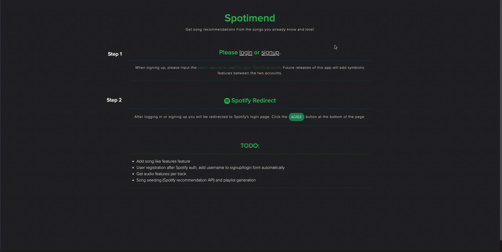

<p align="center">
  <a href="https://github.com/github_username/repo_name">
    
  </a>

  <h3 align="center">Spotimend</h3>

  <p align="center">
    An application using Spotify's API to learn more about what you listen to on a daily basis.
    <br />
    <br />
    <a href="https://spotimend.crisp.pw">View Demo</a>
    ·
    <a href="https://github.com/sellerscrisp/spotimend/issues">Report Bug</a>
    ·
    <a href="https://github.com/sellerscrisp/spotimend/issues">Request Feature</a>
  </p>
</p>

## About the Project


To start, I thought this year's Spotify Wrapped was fairly incorrect for me. I expected a much wider range of music than what Spotify thought I had listened to, and it turns out they were! This project aims to show you what you have really been listening to up until the last six months.
### Built With

Back-end
* [Python](https://github.com/python)
* [Flask](https://flask.palletsprojects.com)
* [Spotify Web API](https://developer.spotify.com/documentation/web-api/reference/)
* [jQuery](https://api.jquery.com/)
* [Postgres](https://postgresql.org)

Front-end
* [Bootstrap v5.0](https://getbootstrap.com/docs/5.0/getting-started/introduction/)
* [Fontawesome](https://fontawesome.com/)
* [Proxima Nova (font)](https://www.marksimonson.com/fonts/view/proxima-nova)

## Getting Started
To get a local copy up and running follow these simple steps.
### Prerequisites
- Python 3.6+
- Spotify developer account
  - [Log in/sign up](https://developer.spotify.com/dashboard/login)
  - Click "Create an App" and name the app/accept terms
  - Edit settings ⟶ Redirect URIs ⟶ add "http://127.0.0.1:5000/callback/q" ⟶ save
### Installation
1. Clone the repo
    ```sh
    git clone https://github.com/sellerscrisp/spotimend.git
    ```
2. Create a python virtual environment and activate it
    ```sh
    python -m venv venv
    source venv/bin/activate
    ```
3. Install requirements with pip
    ```sh
    pip install -r requirements.txt
    ```
4. Export environment variables
    ```sh
    export SECRET_KEY='some_secret_key'
    export CLIENT_ID='spotify_client_id'
    export CLIENT_SECRET='spotify_client_secret'
    export SQLALCHEMY_DATABASE_URI='postgresql:///spotimend'
    export FLASK_APP=run
    export FLASK_ENV=development
    ```
5. Start the server
    ```sh
    flask run
    ```

## Contributing

Contributions are what make the open source community such an amazing place to learn, inspire, and create. Any contributions you make are **greatly appreciated**.

1. Fork the Project
2. Create your Feature Branch (`git checkout -b feature/AmazingFeature`)
3. Commit your Changes (`git commit -m 'Add some AmazingFeature'`)
4. Push to the Branch (`git push origin feature/AmazingFeature`)
5. Open a Pull Request

## Todo

* Modal/dynamically load track audio features per song
* Store songs and their respective likes
* Song seed recommendations
* Playlist generation
* Database configuration and implementation